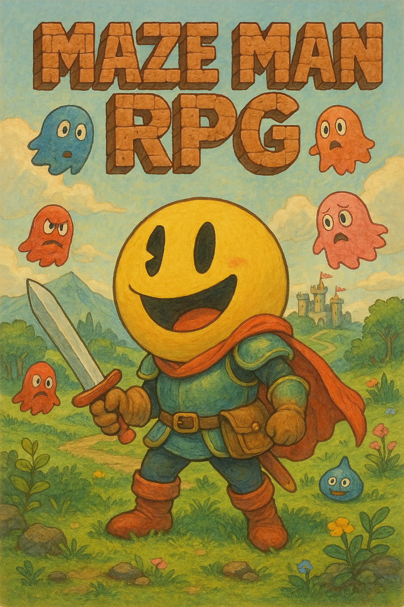
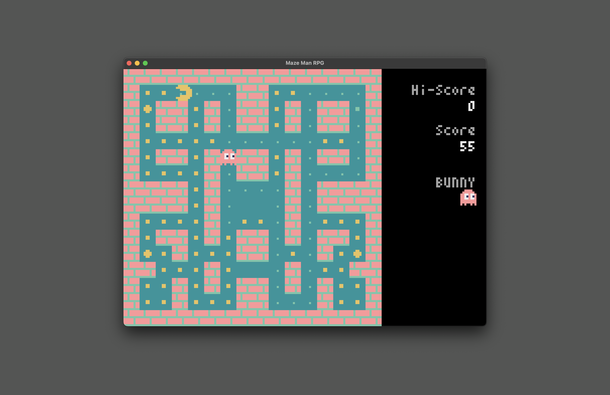
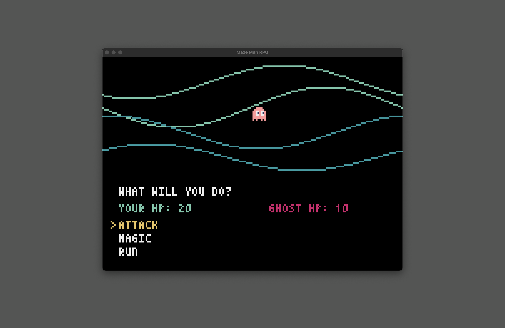
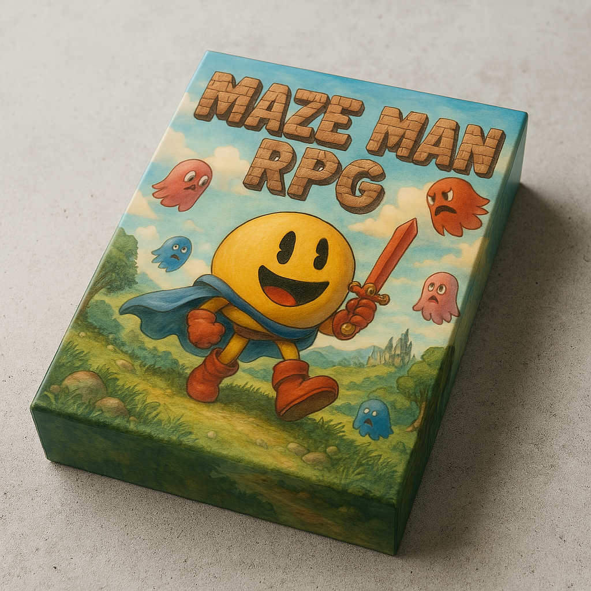

# Maze Man RPG

A Pyxel game by Eli & son. A fork of [MazeWalkGame](https://github.com/Hiekichi/MazeWalkGame) by Hiekichi.

**[▶ Play the game online with a keyboard and web browser!](https://kitao.github.io/pyxel/wasm/launcher/?run=eliheuer.maze-man-rpg.maze-man-ripg)**







## Overview
- A dot-eating maze game with JPRG style battles.
- Game created for programming learning with children

## Build
Hey kids! Let's get the game running on your computer. Follow these fun steps:

1. First, make sure you have Python installed on your computer. Ask a grown-up if you need help!

2. Open a terminal or command prompt. It's like a special window where we can type magic commands!

3. Let's create a special playground for our game:
   ```
   python -m venv maze-game-world
   ```

4. Now let's step into our playground:
   - On Windows, type: `maze-game-world\Scripts\activate`
   - On Mac or Linux, type: `source maze-game-world/bin/activate`

5. Let's get the Pyxel game engine (it's what makes our game work):
   ```
   pip install pyxel
   ```

6. Time to play! Run the game with:
   ```
   python maze-man-rpg.py
   ```

7. If the game doesn't start, try:
   ```
   python3 maze-man-rpg.py
   ```

When you're done playing, you can exit our playground by typing `deactivate` in the terminal.

## How to Play
- Avoid ghosts while eating dots.
- Controls: gamepad or keyboard.
- Only one level.
- Game over if your character gets caught (no extra lives).
- There are 4 types of enemies, each with different movement patterns.



## Original Japanese Content / 元の日本語コンテンツ

### 概要
- プログラミング学習用に作成したドットイートゲームです。
- ナニカ問題がありましたら対応させていただきたいと思います。

### 遊び方など
- オバケを避けつつドットイートしてください。
- ゲームパッドかキーボードで操作します。
- 1面のみです。アハハハ。
- 自キャラがひとりやられたらおしまいです（残機無し）。
- 敵キャラは4種類で、それぞれ異なった動きをします。

### その他
- **ゲームパッドに対応しました。** 

### 動作確認はこちらから
- [Pyxel Web Launcher](https://kitao.github.io/pyxel/wasm/launcher/?run=Hiekichi.MazeWalkGame.MazeWalkGame180)
- [ハンドヘルドゲーム機用(pyxappファイル)](https://github.com/Hiekichi/MazeWalkGame/blob/main/MazeWalk.pyxapp)

楽しかったレトロな日々を思い出しつつ作成してみました
